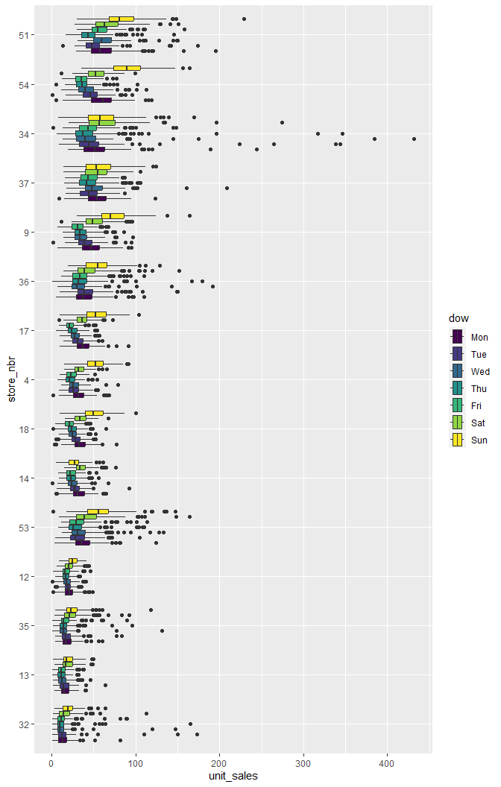

Exploratory Data Analysis - Single bakery item
================

## Training data

### Date continuity and missing values

- The 359th (360th on a leap year) day is Christmas day and there is no
  data for this day

``` r
train %>% 
  mutate(day = lubridate::yday(date)) %>% 
  group_by(year = year(date)) %>% 
  summarise(n = n(),
            min = min(day),
            max = max(day),
            distinct_days = n_distinct(day),
            NAs = sum(is.na(day)),
            missing_days = paste(setdiff(1:366,day), collapse = ", "))
```

    ## # A tibble: 5 × 7
    ##    year     n   min   max distinct_days   NAs missing_days                      
    ##   <dbl> <int> <dbl> <dbl>         <int> <int> <chr>                             
    ## 1  2013 16885     1   365           364     0 359, 366                          
    ## 2  2014 17112     1   365           364     0 359, 366                          
    ## 3  2015 18308     1   365           364     0 359, 366                          
    ## 4  2016 19092     1   366           365     0 360                               
    ## 5  2017 12078     1   227           227     0 228, 229, 230, 231, 232, 233, 234…

### Visualise time series

Monthly sales of bakery/bread item in each store location

``` r
## Month 
train %>% 
  mutate(dom = ymd(paste(year(date),month(date),1, sep = "-"))) %>% 
  count(dom, store_nbr, wt = unit_sales) %>% 
  ggplot(aes(x = dom, y = n, col = store_nbr, group = store_nbr)) +
  geom_line() +
  scale_x_date(date_labels = "%b %Y", date_breaks = "3 month") +
  labs(x = "Date",
       y = "Monthly sales") +
  theme_bw() +
  theme(axis.text.x = element_text(angle = 90))
```

<!-- -->

### Daily sales by store

- Some stores have large outliers (29, 33, 34)
- The median sales are relatively similar

``` r
train %>% 
  mutate(store_nbr = factor(store_nbr),
         store_nbr = fct_reorder(store_nbr, unit_sales, median)) %>% 
  ggplot(aes(x = unit_sales, y = store_nbr)) +
  geom_boxplot()
```

<!-- -->

### Total sales by day of the week

- Sunday has the largest volume of sales, significantly more than other
  days
- Saturday has the second largest volume of sales
- There is a smaller variance between total sales for other days of the
  week

``` r
train %>% 
  arrange(store_nbr, date) %>% 
  mutate(dow = lubridate::wday(date, label = TRUE)) %>% 
  group_by(store_nbr, dow) %>% 
  summarise(unit_sales_total = sum(unit_sales),
            n = n(),
            .groups = "drop") %>% 
  mutate(store_nbr = factor(store_nbr),
         store_nbr = fct_reorder(store_nbr, unit_sales_total, sum)) %>% 
  ggplot(aes(x = unit_sales_total, y = store_nbr, col = dow)) + 
  geom_point() +
  ggrepel::geom_label_repel(data = ~group_by(., dow) %>% sample_n(size = 1),
                            aes(label = dow),
                            min.segment.length = 0,nudge_x = -5000)
```

<!-- -->

### Daily sale box plot

A sample of 15 stores

- Clearly shows as above, Sunday and Saturday are the bigest sale days

``` r
train %>% 
  filter(store_nbr %in% sample(1:54,15)) %>% 
  arrange(store_nbr, date) %>% 
  mutate(dow = lubridate::wday(date, label = TRUE, week_start = 1),
         store_nbr = factor(store_nbr),
         store_nbr = fct_reorder(store_nbr, unit_sales, sum)) %>% 
  ggplot(aes(x = unit_sales, y = store_nbr, fill = dow)) + 
  geom_boxplot()
```

<!-- -->
