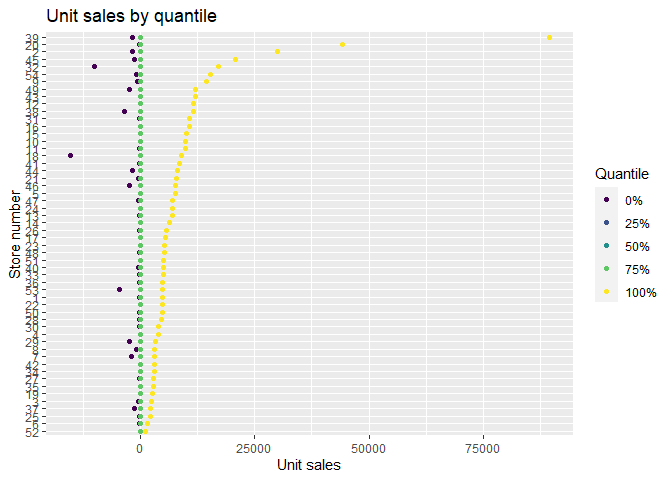
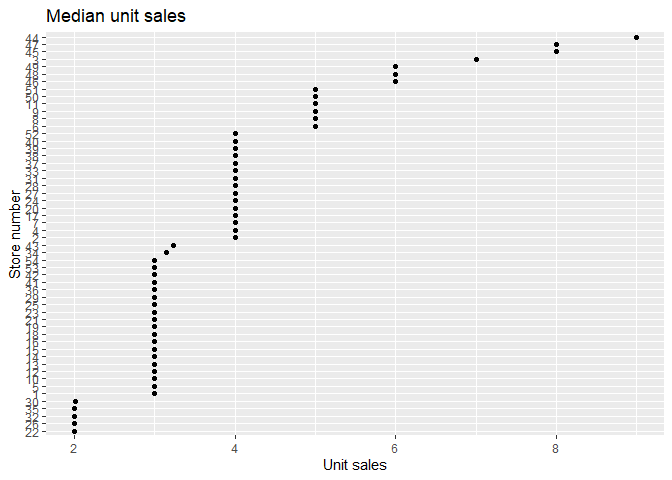
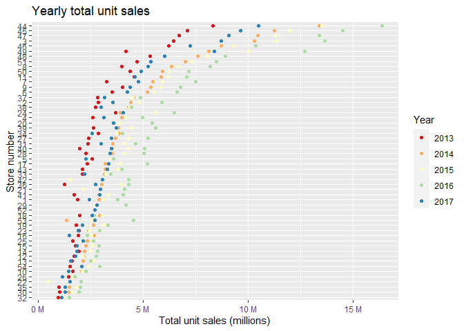
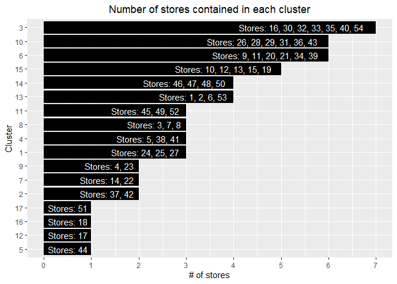
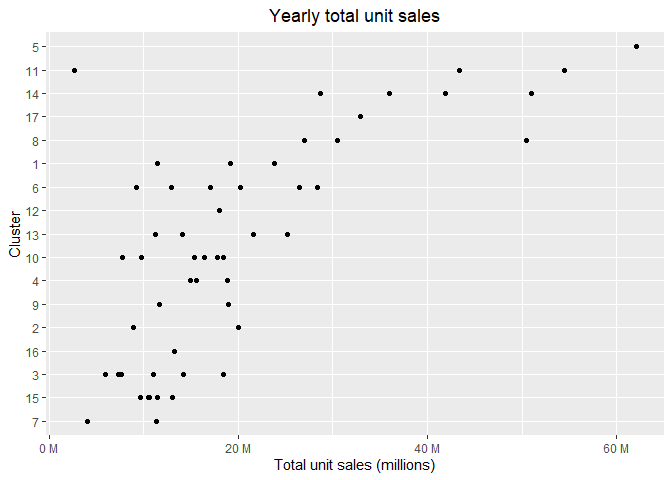
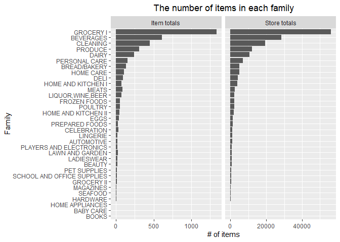
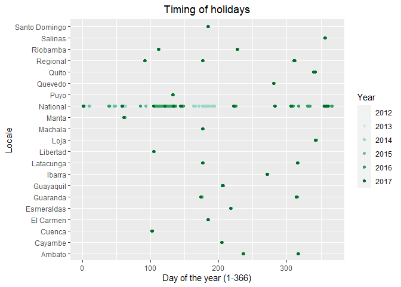
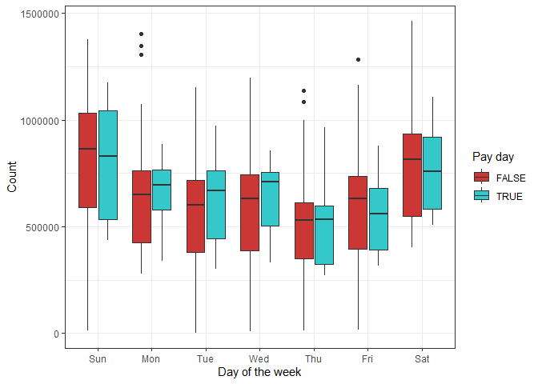

Exploratory Data Analysis - Full data
================

## Data overview

- Train has 125 million rows and consumes a large amount of RAM. Will be
  challenging to visualise and model
- All tables only have a few columns, meaning feature engineering should
  be a shorter process
- 4100 sale items

``` r
tibble(Table = c("holidays", "items", "oil", "stores", "test", "train", "transactions"),
       Rows = map_int(list(holidays, items, oil, stores, test, train, transactions),nrow),
       Columns = map_int(list(holidays, items, oil, stores, test, train, transactions),ncol),
       `Column names` = map_chr(list(holidays, items, oil, stores, test, train, transactions),~colnames(.x) %>% paste(collapse = ", "))) %>% 
  arrange(-Rows) %>% 
  knitr::kable(format = "markdown")
```

| Table        |      Rows | Columns | Column names                                              |
|:-------------|----------:|--------:|:----------------------------------------------------------|
| train        | 125497040 |       6 | id, date, store_nbr, item_nbr, unit_sales, onpromotion    |
| test         |   3370464 |       5 | id, date, store_nbr, item_nbr, onpromotion                |
| transactions |     83488 |       3 | date, store_nbr, transactions                             |
| items        |      4100 |       4 | item_nbr, family, class, perishable                       |
| oil          |      1218 |       2 | date, dcoilwtico                                          |
| holidays     |       350 |       6 | date, type, locale, locale_name, description, transferred |
| stores       |        54 |       5 | store_nbr, city, state, type, cluster                     |

## Test/train

### Dates

- Train dates run from Jan 1 2013 to Aug 15 2017
- Test runs for the 16 days left in Aug 2017
- Forecasting is only for 16 days past the last training record
- All data sets are missing the 359th/360th day which is christmas day.
  For train, every other day of the year has at least one record,
  although according to the data description - “The training data does
  not include rows for items that had zero unit_sales for a store/date
  combination”

``` r
# Create spans of integers - https://stackoverflow.com/questions/16911773/collapse-runs-of-consecutive-numbers-to-ranges
findIntRuns <- function(run){
  rundiff <- c(1, diff(run))
  difflist <- split(run, cumsum(rundiff!=1))
  unlist(lapply(difflist, function(x){
    if(length(x) %in% 1:2) as.character(x) else paste0(x[1], "-", x[length(x)])
  }), use.names=FALSE)
}

train %>% 
  transmute(date, tbl = "train") %>% 
  bind_rows(test %>% 
              transmute(date, tbl = "test")) %>% 
  distinct(date, .keep_all = TRUE) %>% 
  mutate(day = lubridate::yday(date)) %>% 
  group_by(year = year(date),tbl) %>% 
  summarise(n = n(),
            min = min(date),
            max = max(date),
            distinct_days = n_distinct(day),
            NAs = sum(is.na(day)),
            missing_days = setdiff(1:366,day) %>% findIntRuns() %>% paste(collapse = ", ")) %>% 
  arrange(min) %>% 
  knitr::kable(format = "markdown")
```

    ## `summarise()` has grouped output by 'year'. You can override using the
    ## `.groups` argument.

| year | tbl   |   n | min        | max        | distinct_days | NAs | missing_days   |
|-----:|:------|----:|:-----------|:-----------|--------------:|----:|:---------------|
| 2013 | train | 364 | 2013-01-01 | 2013-12-31 |           364 |   0 | 359, 366       |
| 2014 | train | 364 | 2014-01-01 | 2014-12-31 |           364 |   0 | 359, 366       |
| 2015 | train | 364 | 2015-01-01 | 2015-12-31 |           364 |   0 | 359, 366       |
| 2016 | train | 365 | 2016-01-01 | 2016-12-31 |           365 |   0 | 360            |
| 2017 | train | 227 | 2017-01-01 | 2017-08-15 |           227 |   0 | 228-366        |
| 2017 | test  |  16 | 2017-08-16 | 2017-08-31 |            16 |   0 | 1-227, 244-366 |

## Transactions

- Transactions table continues until the end of the training date,
  there’s no data available for dates in test

``` r
transactions %>% 
distinct(date, .keep_all = TRUE) %>% 
  mutate(day = lubridate::yday(date)) %>% 
  group_by(year = year(date)) %>% 
  summarise(n = n(),
            min = min(date),
            max = max(date),
            distinct_days = n_distinct(day),
            NAs = sum(is.na(day)),
            missing_days = setdiff(1:366,day) %>% findIntRuns() %>% paste(collapse = ", ")) %>% 
  arrange(min) %>% 
  knitr::kable(format = "markdown")
```

| year |   n | min        | max        | distinct_days | NAs | missing_days |
|-----:|----:|:-----------|:-----------|--------------:|----:|:-------------|
| 2013 | 364 | 2013-01-01 | 2013-12-31 |           364 |   0 | 359, 366     |
| 2014 | 364 | 2014-01-01 | 2014-12-31 |           364 |   0 | 359, 366     |
| 2015 | 364 | 2015-01-01 | 2015-12-31 |           364 |   0 | 359, 366     |
| 2016 | 363 | 2016-01-02 | 2016-12-31 |           363 |   0 | 1, 3, 360    |
| 2017 | 227 | 2017-01-01 | 2017-08-15 |           227 |   0 | 228-366      |

## Stores

- Some stores have days where their sales are much larger than their
  median unit sales

``` r
train %>% 
  group_by(store_nbr) %>% 
  summarise(qtiles = quantile(unit_sales, probs = seq(0, 1, 0.25), na.rm = FALSE,
         names = TRUE) %>% list()) %>% 
  unnest_wider(qtiles) %>% 
  pivot_longer(cols = -store_nbr) %>%
  mutate(name = factor(name,
                            levels = c("0%","25%","50%","75%","100%"),
                            ordered = T),
         store_nbr = factor(store_nbr)) %>% 
  ggplot(aes(x = value, y = fct_reorder(store_nbr,value,max), col = name)) +
  geom_point() +
  labs(x = "Unit sales",
       y = "Store number",
       title = "Unit sales by quantile",
       col = "Quantile")
```

<!-- -->

#### Median unit sales per item

- For all stores, the median units sold per item is between 2-8. Stores
  sell lots of low number of items per day?

``` r
train %>% 
  group_by(store_nbr) %>% 
  summarise(median_sales = median(unit_sales)) %>% 
  mutate(store_nbr = factor(store_nbr)) %>% 
  ggplot(aes(x = median_sales, y = fct_reorder(store_nbr,median_sales))) +
  geom_point() +
  labs(x = "Unit sales",
       y = "Store number",
       title = "Median unit sales",
       col = "Median")
```

<!-- -->

#### Store toal sales

- Some stores have a significant difference between their totals sales
  year-to-year

``` r
total_sales <- train %>% 
  count(year = year(date), store_nbr, wt = unit_sales, name = "unit_sales") %>% 
  mutate(store_nbr = factor(store_nbr))

total_sales %>% 
  ggplot(aes(x = unit_sales, y = fct_reorder(store_nbr,unit_sales), col = factor(year))) +
  geom_point() +
  scale_color_brewer(palette = "Spectral") +
  scale_x_continuous(labels = scales::unit_format(unit = "M", scale = 1e-6)) +
  labs(x = "Total unit sales (millions)",
       y = "Store number",
       title = "Yearly total unit sales",
       col = "Year")
```

<!-- -->

#### Store toal sales by cluster

- Clusters contain between 1 and 7 stores

``` r
stores %>% 
  group_by(cluster) %>% 
  summarise(n = n(),
            stores_label = paste(store_nbr, collapse = ", ")) %>% 
  mutate(cluster = factor(cluster)) %>% 
  ggplot(aes(x = n, y = fct_reorder(cluster, n))) +
  geom_col(fill = "black") +
  scale_x_continuous(breaks = 0:10) +
  geom_text(aes(label = paste("Stores:", stores_label)), hjust = 1.1, col = "white") +
  labs(x = "# of stores",
       y = "Cluster",
       title = "Number of stores contained in each cluster") +
  theme(plot.title = element_text(hjust = 0.5))
```

<!-- -->

- It appears as if clusters have a strong total sales relationship

``` r
 cluster_total <- train %>% 
  left_join(stores,
            by = "store_nbr") %>% 
  count(cluster = factor(cluster), store_nbr, wt = unit_sales, name = "unit_sales") %>% 
  mutate(store_nbr = factor(store_nbr))

cluster_total %>% 
  ggplot(aes(x = unit_sales, y = fct_reorder(cluster,unit_sales))) +
  geom_point() +
  scale_color_brewer(palette = "Spectral") +
  scale_x_continuous(labels = scales::unit_format(unit = "M", scale = 1e-6)) +
  labs(x = "Total unit sales (millions)",
       title = "Yearly total unit sales",
       y = "Cluster")  +
  theme(plot.title = element_text(hjust = 0.5))
```

<!-- -->

## Items

#### Which items are in the most/least number of stores

- Show if the store has ever sold each item, counted by family

``` r
train %>% 
  distinct(store_nbr, item_nbr) %>% 
  left_join(items) %>% 
  count(family) %>% 
  mutate(type = "Store totals") %>% 
  bind_rows(items %>% 
  count(family) %>% 
    mutate(type = "Item totals")) %>% 
  ggplot(aes(x = n, y = fct_reorder(family, n))) +
  geom_col() +
  labs(x = "# of items",
       title = "The number of items in each family",
       y = "Family")  +
  theme(plot.title = element_text(hjust = 0.5)) +
  facet_grid(.~type, scales = "free_x")
```

    ## Joining, by = "item_nbr"

<!-- -->

#### Perishable

- 25% of items are perishable

``` r
items %>% 
  count(perishable) %>% 
  mutate(pct = scales::percent(n/sum(n))) %>% 
  knitr::kable(format = "markdown")
```

| perishable |    n | pct |
|-----------:|-----:|:----|
|          0 | 3114 | 76% |
|          1 |  986 | 24% |

### Holidays

- There are National holidays that run throughout a large portion of the
  year
- There are sporadic local holidays in each locale that occur on
  approximately the same day each year

``` r
holidays %>% 
  mutate(locale_extra = if_else(locale == "Local", locale_name,locale)) %>% 
  ggplot(aes(x = yday(date), y = locale_extra,col = factor(year(date)))) +
  geom_point() +
  scale_color_brewer(palette = 2) + 
  labs(x = "Day of the year (1-366)",
       y = "Locale",
       col = "Year",
       title = "Timing of holidays") +
  theme(plot.title = element_text(hjust = 0.5))
```

<!-- -->

#### Joining holidays to data set

- There’s no common named key to join the holidays by locale
- Some locales may not have local holidays? They’re the missing values?

``` r
holidays %>%
  mutate(tbl = "h") %>% 
  full_join(stores %>% mutate(tbl = "s"),
            by = c("locale_name" = "city")) %>% 
  count(tbl.x, tbl.y) %>% 
  transmute(key_match = case_when(
    !is.na(tbl.x) & !is.na(tbl.y) ~ "Match",
    is.na(tbl.x) ~ "Holiday no locale",
    is.na(tbl.y) ~ "Locale no holiday"), n)
```

    ## # A tibble: 3 × 2
    ##   key_match             n
    ##   <chr>             <int>
    ## 1 Match               512
    ## 2 Locale no holiday   198
    ## 3 Holiday no locale     3

### Pay day

From the Kaggle comp - “Wages in the public sector are paid every two
weeks on the 15th and on the last day of the month. Supermarket sales
could be affected by this.”

- Appears that this has a minor effect on the total sales, when looking
  at all sales. The effect might be different for different item types.

``` r
train %>% 
  mutate(pay_day = if_else(date == ceiling_date(date, "month") - days(1) | day(date) == 15,TRUE,FALSE)) %>%
  count(date, pay_day, wt = unit_sales) %>% 
  ggplot(aes(x = wday(date,label = T), y = n, fill = factor(pay_day))) +
  geom_boxplot() +
  scale_fill_manual(values = c("#CA3735", "#35C8CA")) +
  theme_bw() +
  labs(x = "Day of the week",
       y = "Count",
       fill = "Pay day")
```

<!-- -->
